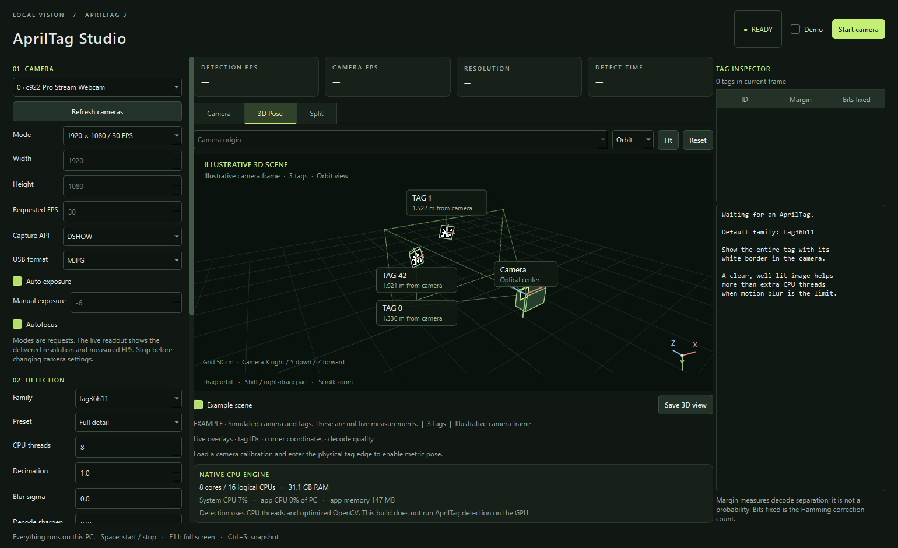
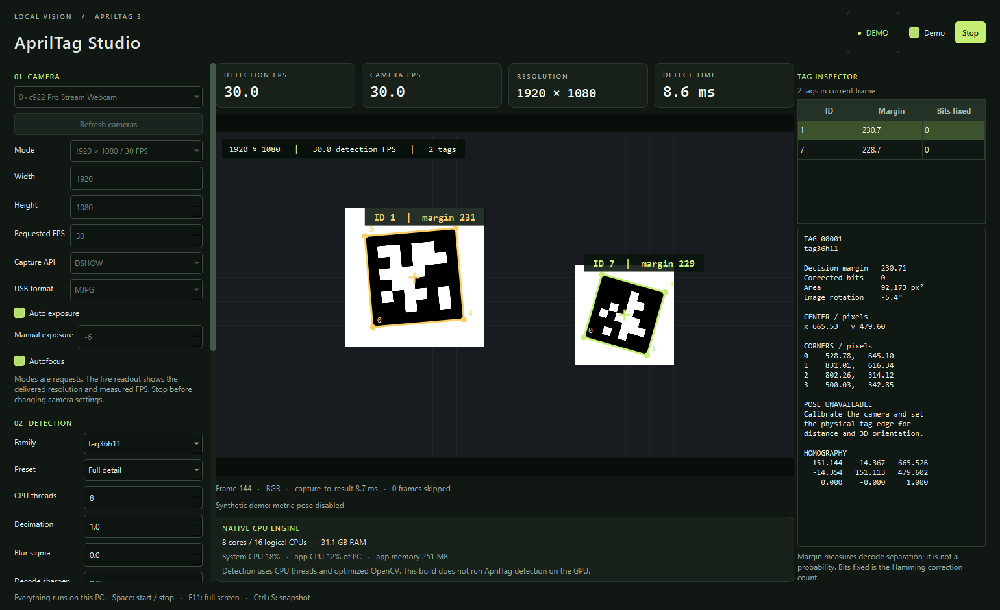

# AprilTag Studio

[](https://github.com/Romgi/apriltag-studio/actions/workflows/ci.yml)

**A local Windows webcam viewer for AprilTag detection and calibrated 3D pose.**

Outline tags in a live USB camera feed, inspect their IDs and decoding measurements, and explore the camera and visible tags in an interactive 3D scene. Camera frames stay on your computer; the application works offline after installation.

[Download the latest Windows release](https://github.com/Romgi/apriltag-studio/releases/latest) · [User guide](docs/USER_GUIDE.md) · [Camera calibration](docs/CALIBRATION.md) · [3D pose guide](docs/3D_POSE.md)



*The 3D example uses simulated poses so you can explore the interface without a calibrated webcam.*

## Features

- Live outlines, tag IDs, numbered corners, center coordinates, area, image rotation, decision margin, and corrected-bit counts.
- Measured camera FPS, detection FPS, delivered resolution, processing time, and CPU/memory usage.
- Eight AprilTag families, adjustable detector settings, and a CPU-thread benchmark.
- Camera, 3D Pose, and Split layouts; orbit, pan, zoom, viewpoint presets, and clickable tags.
- Camera-relative or selected-tag-relative 3D coordinates, with explicit missing-anchor and stale-frame states.
- Checkerboard calibration, annotated snapshots, scene JSON, and CSV detection logs.
- Printable sample tags and separate camera-free detector and 3D examples.



## Quick start: Windows portable app

1. Download `AprilTagStudio-v0.1.0-windows-x64.zip` from the [releases page](https://github.com/Romgi/apriltag-studio/releases/latest), or the equivalent archive for a newer release.
2. Extract the entire archive. Keep the `portable` folder and its `_internal` directory together.
3. Run **Start AprilTag Studio.cmd**, connect your webcam, and select it in the app.
4. Start with **tag36h11**, **Full detail**, **1920 × 1080 / 30 FPS**, **DSHOW**, and **MJPG**, then click **Start camera**. The live readouts show what your camera actually delivers.

Print the supplied [sample tags](assets/tag36h11-samples.html) at 100% / actual size, or show a sample PNG on another screen. Enable **Demo** to try detection without a webcam. Enable **Example scene** in the 3D panel to explore simulated geometry.

**Live distance and 3D pose require camera calibration and the measured tag edge.** Follow the [calibration guide](docs/CALIBRATION.md) before interpreting metric measurements.

## Run from source

Tested with **64-bit Python 3.13 on Windows**. From the repository directory in PowerShell:

```powershell
py -3.13 -m venv .venv
.\.venv\Scripts\python.exe -m pip install -r requirements.txt
.\.venv\Scripts\python.exe app.py
```

Try the detector demo or illustrative 3D scene:

```powershell
.\.venv\Scripts\python.exe app.py --demo --view split
.\.venv\Scripts\python.exe app.py --pose-example
```

Dependencies are pinned in [requirements.txt](requirements.txt). Downloading them requires internet access; running the application does not require a server or account.

## Test and build

The automated tests use generated images, known geometry, fake cameras, and offscreen Qt widgets; they do not need a webcam.

```powershell
.\.venv\Scripts\python.exe -m pip install -r requirements-dev.txt
.\.venv\Scripts\python.exe -m pytest tests -q
powershell -ExecutionPolicy Bypass -File .\Build.ps1
```

[Build.ps1](Build.ps1) creates its own build environment and produces `portable/AprilTagStudio.exe`. It replaces that generated folder; close the built app before rebuilding and keep recordings and calibration files elsewhere. Keep the executable beside its `_internal` directory when distributing or moving it.

## Know the limits

Detection uses native CPU code and optimized OpenCV operations. This version has **no CUDA/GPU AprilTag detector**. More threads are not always faster; benchmark a representative camera frame.

Camera modes are requests, and exposure or drivers can limit delivered FPS. All visible tags use one configured physical edge length. The 3D scene represents the current processed frame; it is **not a persistent map or tracking system for hidden tags**. Synthetic pose tests do not establish physical distance accuracy. See the [measurement and performance notes](docs/USER_GUIDE.md#performance-and-validation).

## Documentation and dependencies

- [User guide](docs/USER_GUIDE.md): camera setup, metrics, tuning, exports, shortcuts, and troubleshooting.
- [Calibration](docs/CALIBRATION.md): checkerboard workflow, tag size, and calibration reuse.
- [3D pose](docs/3D_POSE.md): controls, reference frames, selection, transforms, and example states.
- [Development](docs/DEVELOPMENT.md): architecture, automated tests, CI, and release packaging.
- [Validation](VALIDATION.md): measured performance and the limits of the tests performed.
- [Contributing](CONTRIBUTING.md) and [changelog](CHANGELOG.md).

The detector is [AprilRobotics AprilTag](https://github.com/AprilRobotics/apriltag), accessed through [pyapriltags](https://github.com/WillB97/pyapriltags). OpenCV handles camera access, image processing, calibration, and pose; PySide6 supplies the desktop interface. Dependency licenses and notices are retained in [THIRD_PARTY_NOTICES.md](THIRD_PARTY_NOTICES.md) and [licenses/](licenses/).

The application's original source is available under the [MIT license](LICENSE). Third-party libraries, attribution pages, and their license files retain their respective terms.
